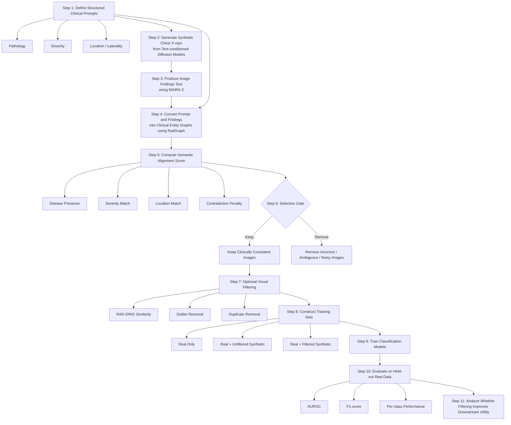

A slightly more formal version for thesis docs:

### Prompt Generation Strategy

- **Prompting**: Structure clinical prompts by disease category
- **Meta Data**: Use `meta_data.csv` to organize disease labels
- **Sampling**: Collect and sample prompts disease-wise from labeled data

### generated images 
- **diffusion model** : 
- **gans** : 
- **rectified flow**:
 

### report generation of generated images 
- **maira-2**: [maira-2](https://huggingface.co/microsoft/maira-2)
- **code file**: mira_inference.py

### 
